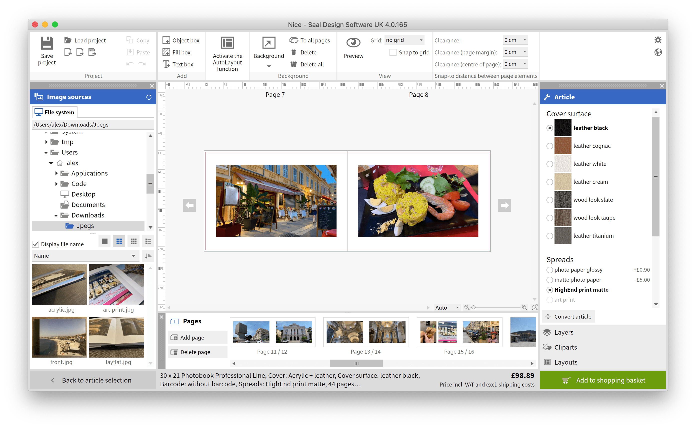
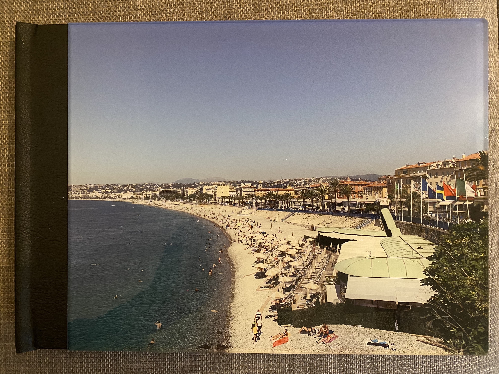
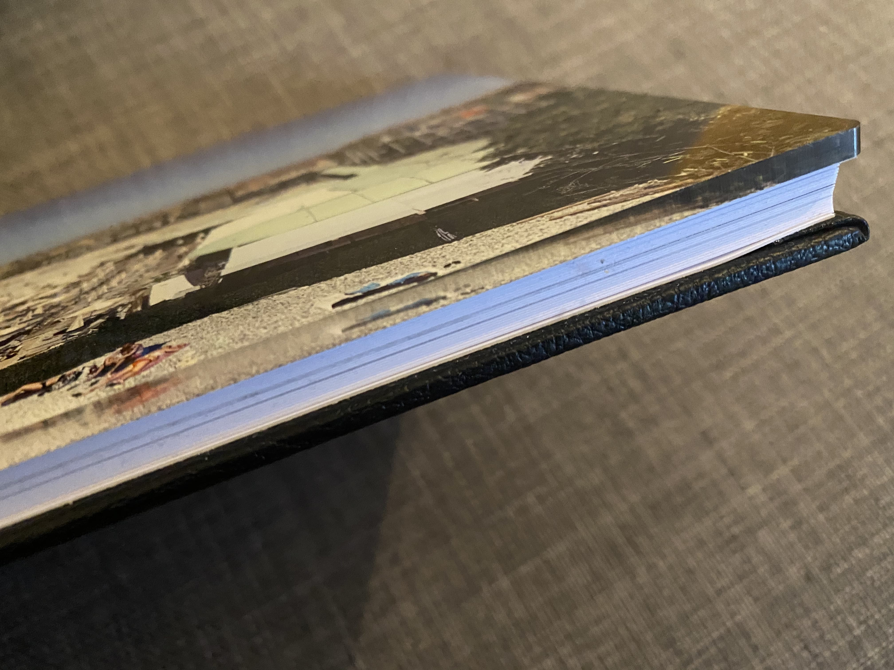
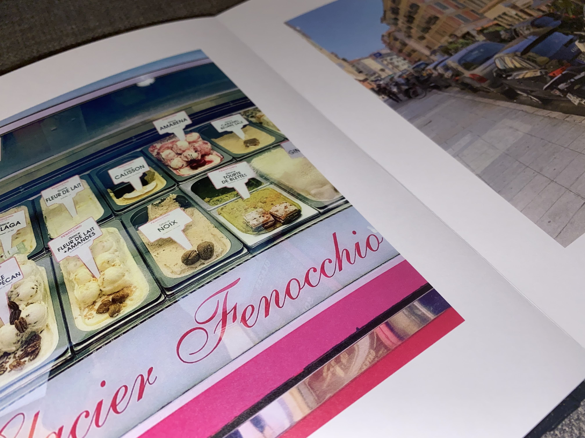
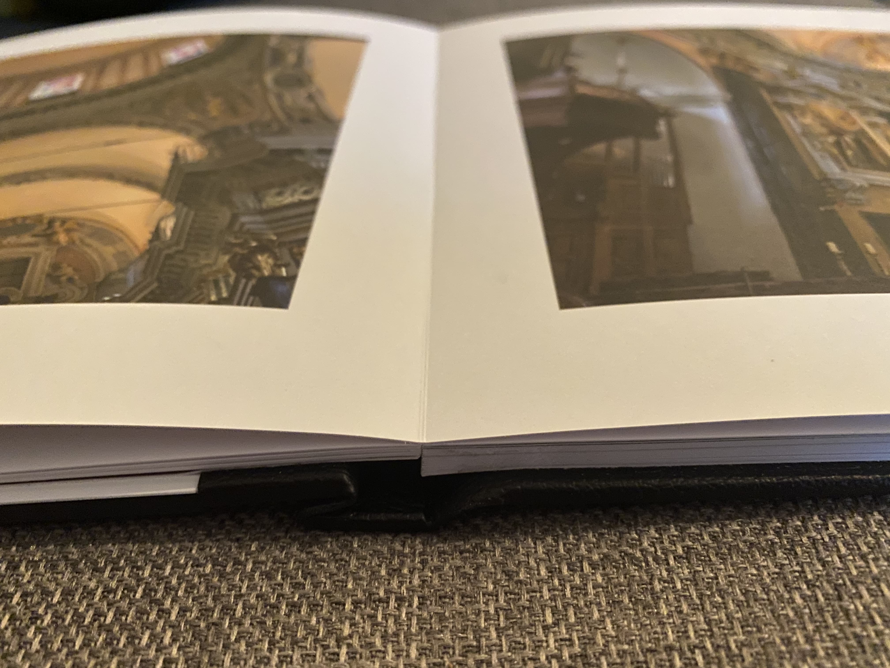

Let me start off by saying that I was given a voucher in order to review this product, but in no way was obliged to provide a positive review. Just honest.

I'm a big fan of putting together photobooks. I think that they're a great way of sharing memories in a form that isn't everyone crowding round your iPad.

A little while ago, the kind people at [Saal Digital](https://www.saal-digital.co.uk/) reached out to me and offered me a voucher to try out their services. Given that I was trying to find an opportunity to put together a book for our holiday in Nice from last year, it was pretty much perfect timing.

In the past, I've used [Blurb](https://www.blurb.co.uk) and [Bob Books](https://www.bobbooks.co.uk) and have been really happy with the results - so Saal had a reasonable standard to meet to impress me.

### Designing the book

First off, the building and designing of the book. Most photobook providers have plugins for the most common pieces of design software as well as their own design software for those who don't use Adobe InDesign etc. Saal Digital were no different.

Once I'd figured out where the common tools were, I found the software easy to use and reasonably snappy. I liked the fact that it was clear about exactly how much the final product would cost as you go through and change options.

There were a number of options that I could customise across both of their product lines - standard or professional. One option that I haven't ever seen with any other provider is an acrylic glass front. The idea of this really intrigued me.

The configuration that I ended up going for was as follows:
- Professional Line 30cm x 21cm
- Black leather and acrylic cover
- High end print matte pages

### The finished product

The front of the photobook is finished well and was delivered with a good level of protection. The acrylic came with a plastic sticker over it to prevent it getting scratched in transit.

In my opinion, the acrylic cover adds a real unique dimension to the books and is something I've never seen before.

I tend to go for a lustre finish on my photobooks (kind of half matte, half glossy) but unfortunately Saal Digital didn't seem to offer that. As I didn't want to go full glossy, I opted for HighEnd print matte, which delivered excellent quality and reproduction of colours but just lacked a little bit of the shine that I would've liked if the option were there.

It was nice to see that lay flat binding was included as standard. This is especially nice if you've got panoramas that span both pages. With other providers, I'd expect to pay for this from experience.

### My conclusion

Just to be totally clear, this book would've cost just shy of £100 plus shipping if I didn't have a voucher. For me, that's a lot of money for a post-holiday photobook. But, don't take this as a negative. The quality of the books is excellent and I would have no objection to paying that amount of money if I required that quality.

I am more than open to trying out one of their cheaper variants of the photobook product next time I make one. With Blurb or Bob Books, I would generally aim to spend around £50 for the same number of pages - a big difference in price.

I'll make sure to write another post if and when I do try one of their other products!

